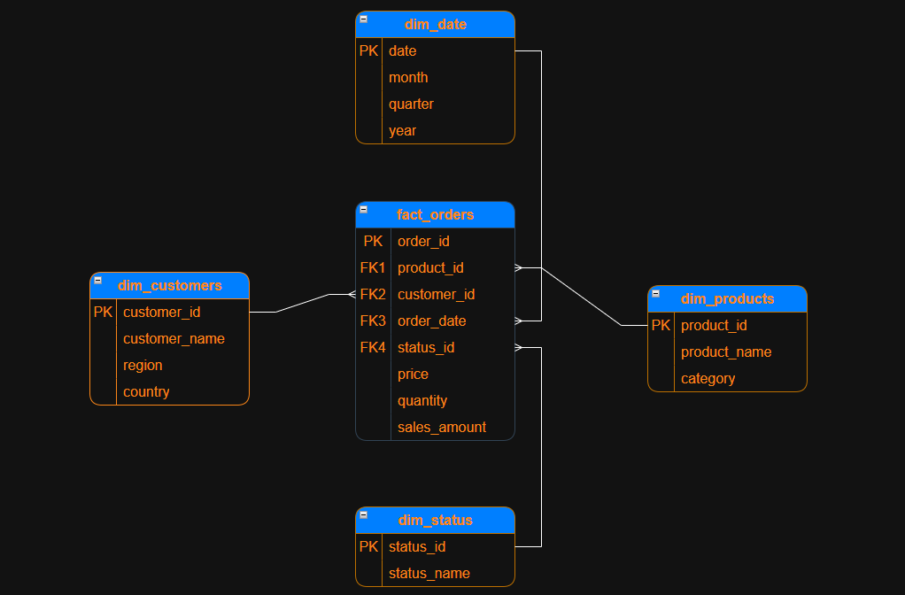
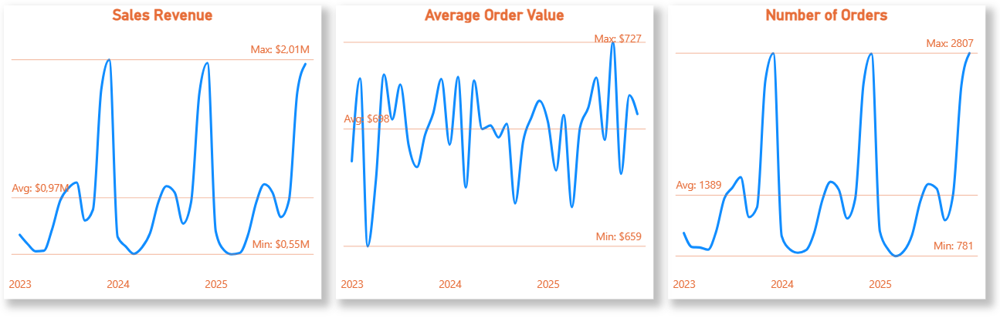

    <h1>NovaCart Ecommerce Performance Report</h1>

<h2 align="center">Company Background</h1>

Founded in 2022, **NovaCart** is a mid-size global e-commerce company selling electronics, home goods, sports gear, and fashion accessories. Products are manufactured mostly in Asia and Eastern Europe and shipped globally. Revenue is concentrated in Europe and North America. Electronics dominate sales, while some niche accessories have very few orders.

The available eCommerce data spans various dimensions and metrics, including sales, products, sales by regions and countries, with 50.000 orders in the database.

An in-depth analysis was conducted to evaluate NovaCart's performance over the past several years (2022–2025). This comprehensive project thoroughly analyzes NovaCart's data in order to uncover some critical insights that can be beneficial in enhancing NovaCart's success. Recommendations will be used by sales, marketing, and product teams to better allocate their resources.

This analysis provides insights and recommendations in some important areas:
- **Sales Trends** - Analyzing key sales metrics like sales revenue, sales revenue growth, average order value, and number of orders.
- **Product Performance** - Determining products that perform well and which product categories are the most preferred by our customers, as well as return rates.
- **Regional Results** - Evaluating regions and countries from which the most customers come in to find out areas for improvement.  

Interactive dashboards made in PowerBI can be found [here](NovaCart.pbix).

SQL Queries used to inspect and clean data for this analysis can be found [here](scripts/Data_Transformation.sql).

Sales and Trend Analysis made in SQL are [here](scripts/Sales_Analysis.sql). 
 
 
<h1 align="center">Entity Relationship Diagram</h1>

Datasets used for this analysis are provided in .csv format and can be found here: [datasets](datasets).  
The dataset comprises 50,000 orders, stored across tables for orders, products, and customers. I used these datasets to build a Power BI data model, which I further enriched with date and order status dimensions. This model features a central 'Orders' fact table, interconnected with dimension tables for Products, Customers, Date, and Status.

  

 
<h1 align="center">Executive Summary</h1>
<h2>Overview of Findings</h2>
Looking at key performance indicators for 2025, there were <b>no significant changes in any of the three indicators.</b> 
 

While **order volume was slightly down by 0,17%**, the other two indicators showed positive changes compared to the previous year: **sales revenue increased by 0,25%**, and **average order value (AOV) rose by 0,42%**.  

Unlike KPIs, sales trend insights definitely seem more eye-catching. There are obvious **seasonal trends** in company sales, especially the ones that are occurring **at the end of the year (November and December), when we have huge sale spikes which are followed by sudden drops in sales after the New Year.**
Sales trend insights, unlike KPIs, are more eye-catching. Obvious **seasonal trends** exist in company sales, particularly at the end of the year (November and December), with significant spikes during the **Black Friday and the Holiday Sale** period followed by sudden drops after the New Year, in the first few months.  

Revenue in 2025 reached 11,6M dollars, driven primarly by **Electronics** which contributed with **50% of total revenue**. Revenue is distributed evenly across top 10 products in our product portfolio.  
The **Europe** as a region dominated revenue, accounted for nearly **55% of total performance**, while **North America** as a second revenue generator contributed with **21% of total revenue**.  

Despite strong sales momentum, **returns remain at 6-8%, especially in Electronics**, where they are the highest, signalling an area for process improvement.

 

<h1 align="center">Deep-Dive Insights</h1>
<h2>Key Performance Indicators</h2>
 
Although we processed slightly fewer orders in 2025 (-0,17%), the average order value increased 0,42%, which helped us maintain overall revenue growth for 0,25%. This is generally a positive sign, and it suggests that customers are either:

* Buying more expensive products
* Adding more products in order baskets  

The reasons for higher AOV can be various, like seasonal promotions that encourage larger purchases or successful upselling strategies.  

## Sales Trends
### Sales Revenue  
Looking at these seasonal and monthly sales revenue trends, we can observe some important patterns.  
Clearly, our business is showing seasonal trends:

    <ul>
        <li>Years are consistently beginning with lower revenue.</li>
        <li>Then revenue increases slightly during the mid-year period(May to July).</li>
        <li>Following a moderate decrease in August and September.</li>
        <li>Revenue reaches significant peaks during November and December.</li>
    </ul>

These spikes are very consistent across all three years and are most likely driven by major promotional periods such as Black Friday, Cyber Monday, and the holiday shopping season, indicating that a <b>substantial portion of our annual revenue is concentrated in the final quarter of the year</b>. Because of this, our Q4 performance is critical for achieving yearly revenue targets.  Another interesting observation is that the <b>seasonal patterns remain stable year over year</b>, suggesting that our customer purchasing behavior is predictable. This predictability allows us to plan inventory levels, marketing campaigns, and promotional strategies more effectively.
  
 
  

### Average Order Value
Average order value(AOV) seems to have more consistency throughout the years. **Average AOV was $698. At its best, it reached $727 in September 2025, while at its lowest in March 2023, it was $659**. The difference between maximum and minimum is just around 10%, so we can say that the average order value stays stable in this period, without larger fluctuations.  
**Average order value is showing growth in 2025 compared to previous years**, with 8 months reaching values above average. Reasons for better performance can be found either in better marketing strategies, higher prices, individual bigger order volume, or higher-priced orders.
### Number Of Orders  
**Orders closely follow sales revenue, indicating that the decline in revenue is primarily due to fewer orders rather than a drop in AOV**. Order volume has highs and lows that look identical to the ones related to sales revenue, and happen in the same periods, so we can clearly conclude that there is a high correlation between sales revenue and the number of orders.  
Big drops in order volume, which, as if by some rule happens at the beginning of the year, already in January, by halving its value from December. Decreasing continues until reaching a minimum in March. After March, it becomes more stable, and we can see moderate increases throughout the summer season. Again lower volume period comes in August and September before hitting huge spikes later in the year.

 
<h1 align="center">Product Performance</h1>

The category comparison shows that **Electronics** significantly outperforms all other categories in total revenue with **$17,2M revenue. With a more than 49% of total revenue** it takes up a large percentage of total company sales and contributes more than double the revenue of any other category. After that comes products from **Sports** and **Home & Kitchen** category that both contributed with **$7,1M** in revenue and at the end **Fashion** category products earned a revenue of **$3,6M**.  
This indicates that customer demand is strongest in technology products and electronics category is our primary revenue driver. Looking at order volume by category, we can clearly see similarity with revenue by category which indicates that the main cause of electronics category's dominance is not higher average selling prices but much higher order volume of technology products compared to others.  

However, when we combine this insight with the return rate analysis in the next section, we see an important operational risk: Electronics also maintains one of the highest return rates across all years.  

Observations from the next chart are telling us that our top 10 products by revenue all generate similar levels of revenue, indicating that sales are relatively diversified rather than dominated by a single product.  
This is generally a healthy sign for product portfolio stability because it reduces the company's dependence on a single product, which lowers business risk.  
Interestingly, out of the top 10 products, 5 of them are technology products, which again proves everything we have already said above about electronics product superiority.  
There is one more important thing that we need to mention. We identified two products with zero sales over a three-year period: "Apple iPad Pro" and "55in OLED S95F 4K Samsung Vision Al Smart TV", indicating either a lack of demand, poor visibility, or potential data or listing issues. This represents tied-up inventory and missed revenue opportunities.

    

 
 
<table align="center">
  <h1 align="center">Refund Rates</h1>
  <tr>
    <td width="500">
       

            
       

    </td>
    <td valign="top" width="500">
        <ul>
            <li><b>Electronics</b> consistently shows the highest return rate across all periods, averaging 7.21%, which may indicate issues such as product incompatibility, unmet customer expectations, or shipping damage.
            </li>
            <li><b>Sport</b> products, while historically having the highest return rate in 2023, show consistent improvement over time, decreasing to 6.88% in 2025. This suggests that recent product or logistics improvements may be reducing returns. 
            </li>
            <li><b>Home & Kitchen</b>, as well as <b>Fashion</b>, both maintain the lowest return rate overall, indicating stable product quality and customer satisfaction in this category.
            </li>
        </ul>
    </td>
  </tr>
</table>
 
<h1 align="center">Customer Performance</h1>

  

**Europe** as a region is convincingly our main revenue driver, which generated $18,2M in the period 2023-2025, which takes up more than 55% of NovaCart's total sales revenue in that period. This performance is far ahead of other regions like **North America** which brought in revenue $7,2M, and **Asia** with $4,4M. Below them remain **South America** and **Africa**, from whose customers we collected $2,3M and $0,9M.  
Although Europe is region that we are most dependent on, countries that generated highest income are not from that region, they are from North America. USA and Canada are at least 25% ahead of European countries revenue wise. There are some regions like Asia and Africa where in most countries we don't have customers and that can be a potential chance to break into those markets. Also, in Australia we dont have customers at all, so there is potentially an expansion chance for us.  

  

Europe is contributing the majority of total sales, but it also maintains moderately high return rates, indicating an opportunity to improve profitability through operational optimization. We are highly dependent on this region, so we have to take that into account.  
North America represents a well-balanced market with solid revenue and relatively low return rates, making it a strong candidate for further expansion.
In contrast, South America shows elevated return rates combined with lower revenue, suggesting operational inefficiencies that should be addressed before scaling.  
Africa, while currently contributing the least revenue, demonstrates the lowest return rates, indicating strong customer satisfaction and potential for future growth if supported by increased market investment.  
Asia brings high risks caused by a high increase of return rate in the last year.  

 
<h1 align="center">Recommendations</h1>

Based on the insights provided above, there are several actions towards various business segments that we can recommend to the NovaCart company.

### Sales Trends

Due to the seasonal character of the company's business, where it peaks during the holiday season and rapidly declines after the New Year, our focus can be to remedy sales lows due to seasonal fluctuations in January and February by increasing marketing campaigns during these low-sales periods. Approaches may vary, but consider:
* Launching new products in January.
* Leftover and flash sales.
* Implementing "New Year, new you" mindset.
* Launching Valentines day sales earlier.

### Products

The company demonstrates balanced revenue allocation among products, so we are not heavily dependent on individual ones. Technology products are by far the best-selling, so we should push them in different ways:
* Continue expanding product assortment in high-performing categories like Electronics.
* Investigate the high return rate causes and emphasize solving them.
* Optimize inventory for high-performing products year-round.  

If return rates in Electronics alone were reduced by even 1–2 percentage points, the impact on total profit could be substantial due to the category’s large revenue contribution.  
Of course, we should also pay attention to low performers with the following:
* Swap bad-performers with new products in the same category. 
* Deprioritizing inventory for products with low-selling performance.
* Systematically evaluate products with zero sales, test demand through marketing and pricing strategies, and if performance remains unchanged, consider discontinuation to optimize inventory and focus on high-performing products.

### Regions

Europe market dominates in regional comparison, while other regions are significantly smaller. Overdependence is fairly risky for our business, so we should try to balance this. Possible steps are:
* Customizing marketing strategies to different regions.
* Some product categories perform better in different regions, identify and push them in suitable regions.
* Continue to scale already well-performing regions like Europe and North America.
* Asia has growth potential, but in order to reach it, we need to find a solution to control the growing return rate.
* More focus on expanding business in low return rate regions like Africa.

### Refund Rates

Although our products from the Electronics category are the main revenue drivers, they bring the highest return rates. Our main goal should be decreasing general return rate, especially Electronics return rate, which would noticeably increase our profitability. Some general recommendations for decreasing overall return rates would be:
* Improve product descriptions and images to reduce customer misunderstanding.
* Add technical specifications and comparison tools on product pages.
* Strengthen quality checks and packaging to reduce damage-related returns.
* For fashion products - introduce detailed size guides, use better product images, and fit descriptions.
* Identify what operational improvements were implemented in categories with decreasing return rates and then replicate those practises with other categories.  

Regarding regional return rate analysis, Asia was unfortunately very problematic in the last year, so we should try to find a solution for it, for example, to implement the above-mentioned recommended actions that would be suited for the mentality, habits, and culture of that region.
